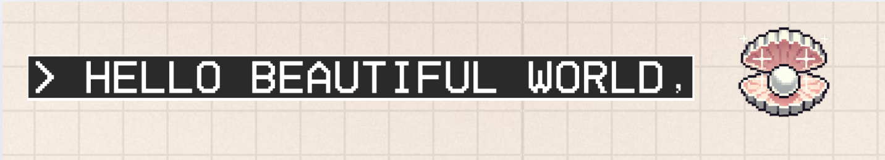

## 

I'm Mitch, a Front-End/UX-UI Engineering  based somewhere on Earth but planning my next escape to somewhere deliciously hot with great seafood.

For previous professional and freelance tech adventures shipped to the high seas check out [chellscript.dev](https://chellscript.dev/)

### ✨ XP and Tech Stack

  
  
  
  
  
  
  
  
  
  

  
  
  
  
  
  
  
  
  
  
  
  
  
  
  
  

### ✨ Quick Stats

- 🍼 **My first ever project: https://github.com/chellscript/CraveLDN**

- ⭐️ **Latest thing I've shipped:** https://github.com/chellscript/bitLeaf

- 💁‍♀️ **Most used css style...**
  Gotta be `display: flex;` baby 💪🏾.

- 🌱 **What I want to learn next**...GSAP animations

- 👀 

- **Favourite Reaction GIF:** 

---

- _Tech badges from [here](https://github.com/alexandresanlim/Badges4-README.md-Profile?tab=readme-ov-file#how-to-use), don't forgt to use a wrapper div with `display:flex;`_ ;)
- _Profile avatar generated with pretty cool [ML Model](https://huggingface.co/alvdansen/sonny-anime-fixed) for non-comerical purposes_
- _Party parrot from this [freaking-awesome website](https://cultofthepartyparrot.com/)_
